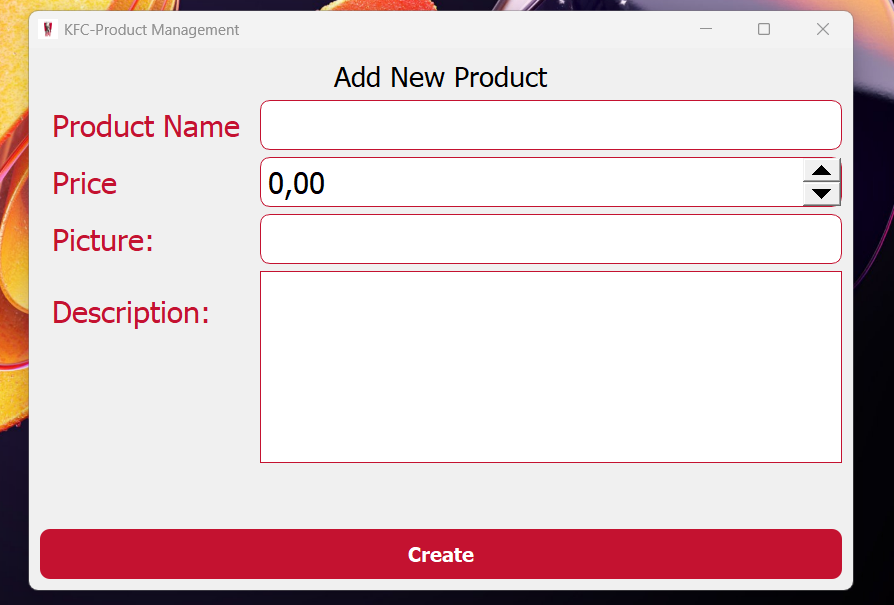

# Setting Up the Project

## Step 1: Create the Database
To start, you need to set up a MySQL database. Open MySQL and create a new database with the following command:

```sql
CREATE DATABASE your_database_name;
```

## Step 2: Create the Products Table
Once the database is created, define a table named `products` with the necessary columns:

```sql
CREATE TABLE products (
    id INT AUTO_INCREMENT PRIMARY KEY,
    product_name VARCHAR(255) NOT NULL,
    price DECIMAL(10,2) NOT NULL,
    image_url TEXT,
    description TEXT
);
```

This table includes:
- `id`: A unique identifier for each product.
- `product_name`: The name of the product (required).
- `price`: The product’s price in decimal format.
- `image_url`: The URL or path of the product image.
- `description`: A text field to describe the product.

## Step 3: Configure Database Connection in `main.py`
In your `main.py` file, update the database connection details with your credentials:

```python
import mysql.connector

connection = mysql.connector.connect(
    host="your_host",  # e.g., 'localhost' or an external MySQL server
    user="your_username",  # Your MySQL username
    password="your_password",  # Your MySQL password
    database="your_database_name"  # The name of the database you created
)
```

## Step 4: Install Flask and Required Dependencies
Ensure you have Flask installed by running:

```bash
pip install flask mysql-connector-python
```

## Step 5: Run the Flask API
Once the database setup is complete and the connection is configured, start the Flask API by executing:

```bash
python app.py
```

If everything is set up correctly, Flask will run and display an output like:

```
Running on http://127.0.0.1:5000
```

Copy the displayed IP address (`http://127.0.0.1:5000` or a different one if specified) for later use.

## Step 6: Integrate the API with Your Website
In your frontend application (e.g., a React or Vue.js project), ensure your Axios requests are configured correctly. Replace the placeholder URL with the one copied from the running Flask server:

```javascript
axios.get("http://127.0.0.1:5000/products")
  .then(response => console.log(response.data))
  .catch(error => console.error("Error fetching data:", error));
```

## Additional Notes:
- Ensure MySQL is running before executing the scripts.
- If connecting to a remote database, configure your firewall and MySQL settings to allow external access.
- More detailed instructions are available in the individual README files within each folder.

